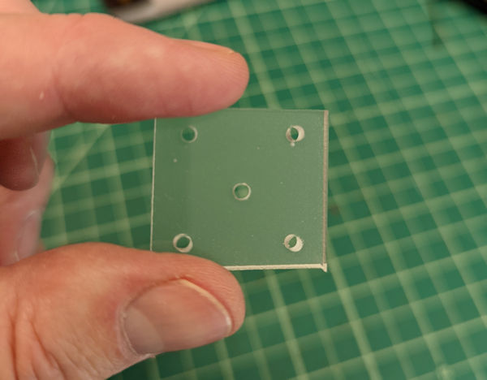
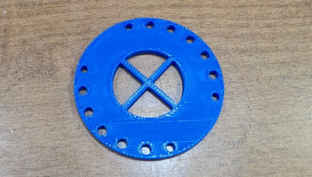
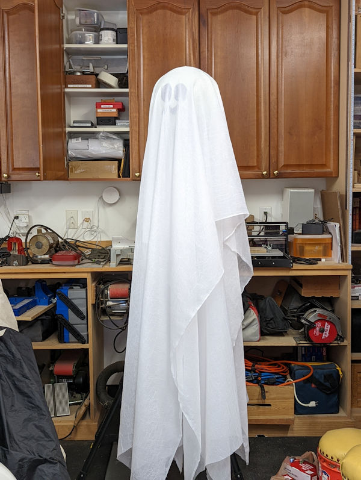

# Glow Globe Circuit Playground

My children were born in late October, so we always make a big deal out of the holiday. Its also a great opportunity to do some cool projects. A few of years ago I created a remote-controlled flame throwing pumpkin (which I hope to publish someday) and last year, due to COVID restrictions, we passed out candy using a Candypult (candy catapult) I created out of some boards and rubber bands; the kids love it!

Last year I purchased some plastic globes and my wife frosted the inside to make them translucent. The plan was create a sound activated Glow Globe, put a microcontroller, microphone, LEDs, and a battery inside and do some cool light flickering based on sounds nearby. I started with an Adafruit Feather microcontroller and the [SparkFun Electret Microphone Breakout](https://www.sparkfun.com/products/12758), but no matter what I did, I could never get the microphone to accurately measure sound level. I played around with it last year and again this year and almost gave up.

I recently joined Oracle as a product manager and discovered the [Oracle Education Foundation](https://oraclefoundation.org/index.html) and quickly volunteered to help in their Hello Circuit Playground program. The program uses the [Adafruit Circuit Playground](https://learn.adafruit.com/introducing-circuit-playground/overview) to help teach high school students Design Thinking and microcontroller-based project development. When I started working with the Circuit Playground, I quickly realized that it was the perfect platform for my Glow Globe project, mostly because it has a ring of NeoPixels, a microphone, and an easy to use SDK.

I copied my original Feather project code into a new folder and rewrote it for the Circuit Playground. The sketch included in this repository does the following:

1. Flash the Circuit Playground's LEDS Green to let you know the sketch is running. 
2. Next, it starts slowly fading up and down random Halloweeny colors (Yellow, Orange, Purple) (the sketch randomly selects the color but also how long it takes to fade all the way up, then down).
3. Listens for sounds nearby (using the microphone) and flashes the LEDs Red whenever it detects sound above a specific threshold.

Here is a video demonstrating what it does: https://youtube.com/shorts/nsneTPzMP5E?feature=share. 

**Note:** In the video, I hadn't yet pulled the covering material down when I made the video, so you can see the globe and Circuit Plaground. With the material pulled down, it looks like a ghost hanging in the air. 

## Configuration

The sketch uses several configuration settings:

```c
// The range of audio values we'll use to trigger the Red LED
#define micMin 70
#define micMax 100

// Change the following to `true` to enable output to the Serial monitor
#define debug false
```

The `micMin` and `micMax` values control the range of sound levels that trigger the LEDs Red. Circuit Playground microphone values range from 0 to 100, but I didn't want the Red LEDs to trigger unless the nearby sound was louder than background noise. Leave `micMax` at 100, I was never able to get a sound value from the microphone that high in my testing. I played around with the `micMin` value until it worked just right for me.

When testing your code, set the value of the `debug` setting to `true` to enable sending debug information to the Serial Monitor.

To add additional colors to the color fading process, simply add values to this array:

```c
int colors[4][3] = {
  {255, 255, 0},  // Yellow
  {255, 165, 3},  // Orange
  {128, 0, 128},  // Purple
  {255, 255, 255} // White
};
```

Be sure to change the first array dimension (`[4]`) if you add or remove colors from the array.

## Assembly

1. We started with a clear globe about 10 or 12 inches across. We didn't want the innards to show so we made it opaque by spraying the inside of the globe with [frosted glass paint](https://www.krylon.com/products/frosted-glass-finish). 

2. Drill a small hole in the top of the globe big enough for the rope or string you'll use to hang the globe

3. We cut eyes and a mouth out of duct tape and taped them to the outside of the globe (in normal eye and mouth positions)

4. Get a bunch of translucent white material to drape over the globe to make it look like a ghost. Cut a hole in the materials where the top of the globe will rest while hanging

5. Cut small squares (about 1.5 inches by 1.5 inches) and drill a hole in the middle and one hole near each corner as shown in the following figure. 

  

  I also included a 3D printer version of a bracket you can use instead. The 3D printed bracket has the same size, shape, and hole configuration of the Circuit Playground, making it easy to connect matching holes between the bracket and Circuit Playground. The 3D printed bracket also has a big hole in the center with cross supports, allowing you to use a bigger rope/string to hang the ghost.

  

6. Run some string or rope through the hole you created in the covering material, then through the hole in the top of the globe, and finally through the hole in the middle of selected bracket. Knot or tie the string/rope to the bracketso you can hold the whole assembly in the air by the string/rope. 

  When you're done, it should look something like the following picture. ( used fishing line, so you can't see the string holding the ghost up in the air.)

  

7. Finally, and I don't have a picture of this, use fishing line or some thin, non-conductive material to connect the four corner holes in the plastic piece to corresponding holes in the Circuit Playground. The point is to suspend the Circuit playground in the middle of the globe. 
8. Attach a charged LiPo battery to the underside of the Circuit Playground and plug it into the Circuit playground. With the right battery, the device should run on power through your whole Halloween celebration.

That's it. Enjoy.
